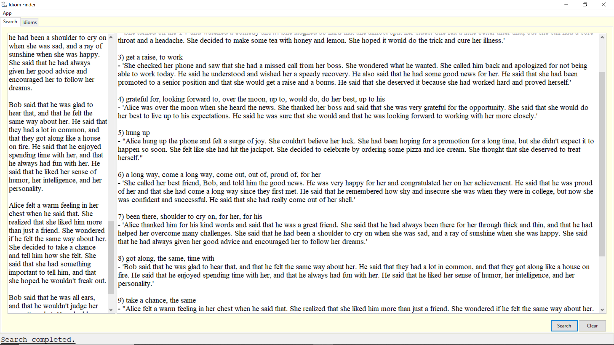
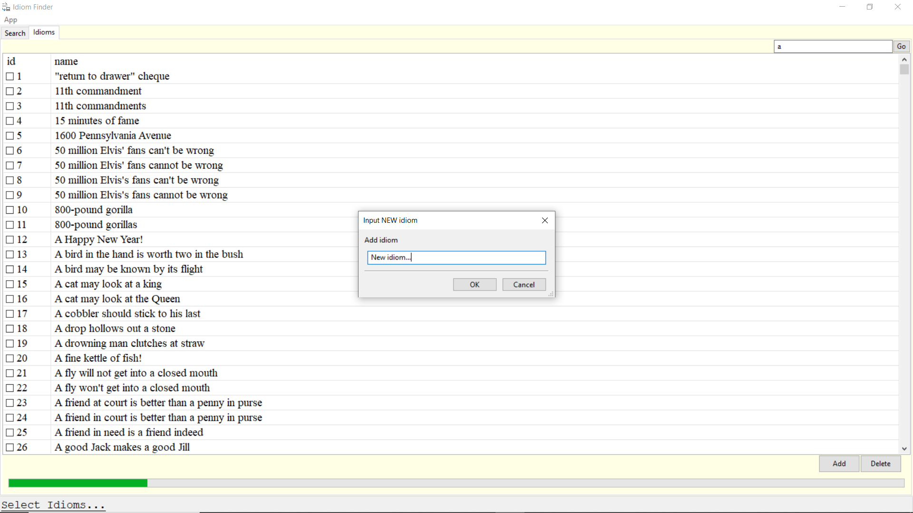
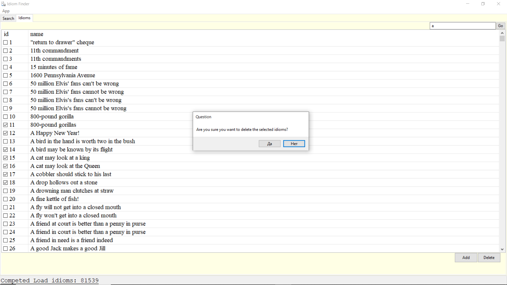
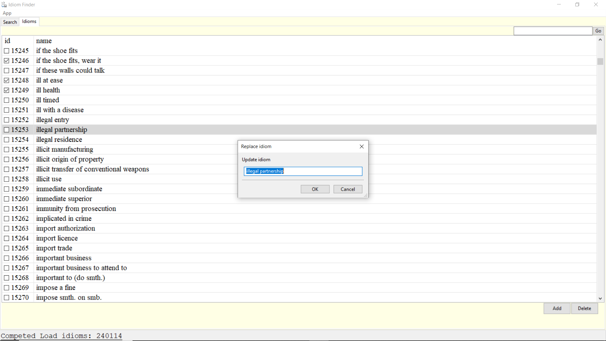
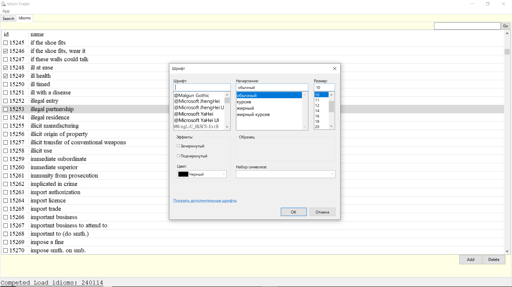
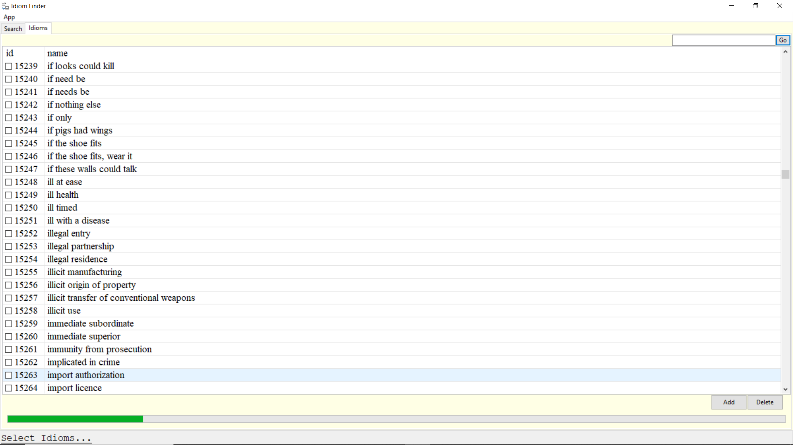

# Idiom Finder

## Features

- Extract idioms from text(subtitles movies/series, articles, ...)
- Reset and CRUD operations in database
- Search idioms in database

## What need

- optimize python code and SQL queries
- speed up the bottleneck(show table with all idioms)
- create a normal algorithm for finding idioms(on the one hand, a small number of idioms and an accurate query gives
  very accurate results, but there are few of them, on the other hand, a large variety of idioms with different forms
  and with a query in a database with different variants of words give a lot of matches,
  but the accuracy decreases disproportionately)

## For users

* Find idioms in text
  
* Add idiom
  
* Delete idiom
  
* Update idiom
  
* Setting Font
  
* Search idioms in DB
  

## Examples

* Empty searcher -> Click `GO` -> All idioms
* `%A%` -> Click `GO` -> All idioms with character `A` or `a`
* `A` -> Click `GO` -> Get idiom where input text == `A` or `a`
* more examples SQL queries 
  + https://www.sqlitetutorial.net/sqlite-like/
  + https://www.sqlite.org/lang_expr.html#like
* Сase insensitive search

### Installing

- ZIP Archive [idiom-finder](https://drive.google.com/file/d/14b0_YBuaEkXgzi0ujJeK9UQF_WYTryfI/view?usp=sharing)

## For developers

0. developing on python3.11(on python3.12 aiohttp crush with pip install) 
   and compilation on python3.12(comment `#aiohttp` in requirements.txt, then `auto-py-to-exe`)

1. download XML file
   from https://master.dl.sourceforge.net/project/xdxf/dicts-XDXF/sdict05/comn_sdict_axm05_idioms_eng_rus.tar.bz2?viasf=1
    - main website http://dicto.org.ru/xdxf.html
    - extract ZIP, rename to idioms.xml

2. create env, install requirements, uncomment main functions and execute python script
    ```bash
    python init_db.py
    ```

3. convert .py to .exe
   ```bash
   auto-py-to-exe
   ```
4. add folders `db` and `imgs`

## Info about idioms
- https://langformula.ru/english-idioms/

## Internet sources

- **the most important source(threading in wxpython)** https://python-forum.io/thread-17858.html
- concurrent.futures — Launching parallel tasks https://docs.python.org/3/library/concurrent.futures.html
- pypy and wxpython https://discuss.wxpython.org/t/pypy-and-wxpython/35505/4
- xml file with idioms http://dicto.org.ru/xdxf.html
- wxpython Doc https://wxpython.org/
- python loops and
  speed https://stackoverflow.com/questions/22108488/are-list-comprehensions-and-functional-functions-faster-than-for-loops
- wx.ListCtrl: Item Information on Double Click https://groups.google.com/g/wxpython-users/c/1d84tNqGeIQ
- connection and cursor objects in
  db https://ru.stackoverflow.com/questions/1175448/%D0%94%D0%BB%D1%8F-%D1%87%D0%B5%D0%B3%D0%BE-%D0%BD%D1%83%D0%B6%D0%B5%D0%BD-commit-connection-cursor-%D0%B8-close#:~:text=connection%20%D0%BF%D1%80%D0%B5%D0%B4%D1%81%D1%82%D0%B0%D0%B2%D0%BB%D1%8F%D0%B5%D1%82%20%D1%80%D0%B5%D0%B0%D0%BB%D1%8C%D0%BD%D1%83%D1%8E%20%D0%B1%D0%B0%D0%B7%D1%83%20%D0%B4%D0%B0%D0%BD%D0%BD%D1%8B%D1%85,%D0%B8%20%D0%BC%D0%B5%D1%82%D0%BE%D0%B4%D0%BE%D0%B2%20%D0%B4%D0%BE%D1%81%D1%82%D1%83%D0%BF%D0%B0%20%D0%BA%20%D0%BD%D0%B8%D0%BC.
- How change style words in
  wx.TextCtrl https://stackoverflow.com/questions/46313673/how-can-i-change-the-color-of-specific-words-in-wxpython-textctrl
- Learn wxpython by YouTube https://proproprogs.ru/wxpython
- wxpython tutorial https://zetcode.com/wxpython/

## Problems
- it is difficult to intercept the error, incorrect application design
